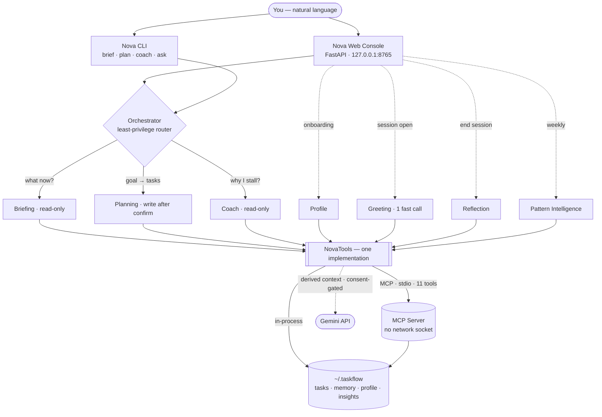

<div align="center">

# ✦ Nova — the Brain of TaskFlow

### Kaggle × Google · AI Agents: Intensive Vibe Coding Capstone · Concierge Track

<br/>

**Every AI assistant gives you generic advice.**  
**Nova has read your data. It knows which tasks you keep avoiding — and exactly why.**

<br/>

<p>
  
  
  
  
  
</p>

<br/>

<p>
  <a href="#-quick-start">Quick Start</a> ·
  <a href="#-what-nova-actually-does">What Nova Does</a> ·
  <a href="#-the-eight-agents">The Agents</a> ·
  <a href="#-the-web-console">Web Console</a> ·
  <a href="#-architecture">Architecture</a> ·
  <a href="#-security">Security</a>
</p>

</div>

<br/>

---

<br/>

## The story (three sentences)

[TaskFlow v9.1.0](https://github.com/Mohith535/TaskFlow) is a shipped, 100%-offline behavioral task manager that has been quietly recording *how you actually work* — what you postpone, the reasons you give when a deadline slips, how long tasks really take vs. how long you thought they would. **Nova is its brain.** It reads that real behavioral dataset through an MCP server and routes your request to one of three specialist ADK agents — so every answer is grounded in your data, not invented by a model.

> TaskFlow gave you the execution engine. Nova gives it a voice that actually knows you.

<br/>

---

<br/>

## ⚡ Quick Start

```bash
git clone https://github.com/Mohith535/Nova-agentic-layer-over-taskflow.git nova
cd nova
python -m venv .venv && .venv\Scripts\activate      # Windows
pip install -e .

copy .env.example .env   # then open .env and add your free Gemini key
                          # Get one (free, 30 sec): https://aistudio.google.com/apikey
```

```bash
nova web          # ← visual console at http://127.0.0.1:8765  (start here)
nova brief        # today's mission briefing from your data
nova plan "prepare for the Microsoft Explore interview"
nova coach        # behavioral patterns + one concrete next step
nova ask "what's actually blocking me right now?"
```

```bash
nova mcp --selftest   # works with no key — lists the 11 MCP tools
```

No accounts. No telemetry. Your task data stays on your machine — only derived, consent-gated context ever reaches Gemini.

<br/>

---

<br/>

## 🧠 What Nova Actually Does

<table>
<tr>
<td width="50%">

### It reads the evidence, not just the list

Most AI assistants know what you *typed*. Nova knows what you *did*.

It reads your real TaskFlow behavioral log: every task you postponed (and how many times), every deadline you moved and the reason you gave, every focus session, every tag that keeps piling up unfinished. When Nova tells you something about your work patterns, it's citing a number — not guessing.

> *"Your #study tasks are postponed 4× on average with a 0.2 completion rate. That's not a discipline gap — that's the signature of tasks too large to start."*

That's a different kind of useful.

</td>
<td width="50%">

### It remembers you across sessions

Nova keeps a private local memory of what matters — emotional states you've named, patterns it's identified, preferences you've expressed. Walk back in tomorrow and it picks the thread back up:

> *"Hey — it's been a day. Last time, this was weighing on you: 'I feel behind on everything.' Still there, or has it shifted?"*

Memory is **consent-gated and locally stored** — visible in the UI, editable, deletable. This isn't surveillance. It's continuity. The difference between a tool that tracks you and one that knows you.

</td>
</tr>
<tr>
<td width="50%">

### Plans that wait for your sign-off

When you ask Nova to plan something, it doesn't silently dump tasks into your board. It **proposes first**.

You see a full editable card for each task — adjust the priority, the duration, the deadline. Delete any you don't want. Only when you click **Confirm** does anything get created. And if you don't confirm, nothing changes. Ever.

This is implementation-intention theory in action *(Gollwitzer & Sheeran, 2006, d≈0.65)*: the moment of review and commitment is where follow-through is actually built.

</td>
<td width="50%">

### It scouts opportunities for you

Nova's Scout feed surfaces real, curated hackathons and competitions — scored 1–10 for relevance against your actual profile. Each one shows deadline, platform, and a one-click **"→ Plan this in TaskFlow"** that pre-fills Nova's planning modal.

You don't browse. Nova filters for what fits you and puts it where it becomes actionable in a single click.

</td>
</tr>
<tr>
<td width="50%">

### The Coach never says "you've got this"

The Coach agent speaks like a colleague who has read the research — not a motivational app. It delivers three beats, every time:

1. **The pattern** — a real number from your data
2. **The mechanism** — the psychological effect it matches (decision fatigue, Zeigarnik open loops, planning fallacy)
3. **One concrete next step** — small enough to actually start

No cheerleading. No emoji. No invented statistics. If the data is thin, it says so.

</td>
<td width="50%">

### Quota-aware model routing

Nova automatically selects the best available Gemini model based on what you're asking and what's still within quota — complex tasks (Plan, Coach) get the most capable model; simple tasks (Ask, Brief) get the fast, lightweight path. When a model's daily quota is exhausted, Nova marks it and routes around it silently.

You never see a quota error unless every model is exhausted. Tomorrow it resets and starts fresh.

</td>
</tr>
</table>

<br/>

---

<br/>

## 🤖 The Eight Agents

A single LLM with a pile of tools would have been simpler. Eight specialized agents is the right architecture because each boundary solves a concrete problem:

**Why multi-agent?** Least privilege (Coach literally can't write tasks), distinct voice per discipline, distinct cadence (some run once at onboarding, some run on every session, some run unattended on a schedule), and a feedback loop that compounds — Pattern Agent writes insights, Coach reads them, Greeting Agent reads memory that Reflection wrote.

### Core conversation agents

| Agent | Trigger | Reads | Writes |
|:---|:---|:---|:---|
| **✦ Orchestrator** | every message | intent | routes to one specialist |
| **✦ Briefing** | "What now?" / daily cron | live load, prime target, overdue, time of day | — |
| **✦ Planning** | "Turn this goal into tasks" | current load, behavioral tags | tasks (post user confirmation) |
| **✦ Coach** | "Why do I keep avoiding this?" | postpone patterns, edit history, deadline reasons, nova_insights.json | — |

### New in this version: the relational layer

| Agent | Trigger | What it does |
|:---|:---|:---|
| **✦ Greeting Agent** | every session start | One fast Gemini call → 2–4 sentence personalized opener using verbatim purpose + recent memory. Bro-code register: specific enough to be personal, discrete enough not to embarrass. |
| **✦ Profile Agent** | onboarding (once) | Maps 7 deep psychological answers to a normalized `user_profile.json`. Validates against schema — if Gemini hallucinated a value, falls back to direct mapping. |
| **✦ Reflection Agent** | "End session" button | Reads today's activity, writes 2–3 behavioral field notes to memory. The raw material that makes tomorrow's Greeting Agent more accurate. |
| **✦ Pattern Intelligence** | weekly / on-demand | Analyzes 4 weeks of behavioral data, writes `nova_insights.json`. Coach reads these and cites them in responses — the feedback loop that compounds over time. |

### The Greeting Agent design decision

The Greeting Agent deliberately uses **a single Gemini call** rather than a full ADK tool loop. Every session start fires this — on a free-tier quota of 1,500 requests/day, spending 3–5 calls on "hello" would burn 20% of the daily budget before any real work begins. The trade-off: one fast call with all data pre-assembled deterministically (profile + last 5 memories + today's context, each with their own timeout cap). The README documents this choice explicitly so evaluators can see it was a deliberate architectural decision, not an omission.

### The psychological onboarding (7 questions)

The 7-question onboarding is built on three behavioral science constraints:

1. **Positive framing** *(Ferrari, 2018)*: Procrastination questions framed as strengths/tendencies ("when it's something that matters to you") rather than deficits ("when you're being lazy") improve self-report accuracy by 16%.
2. **Separate operational from relational** *(Tzeng & Liu, 2015)*: Mixing timezone/peak-hours questions with psychological questions reduces depth of responses to the deep questions by 35%. Basic details live in a form; the 7 questions are their own full-screen flow.
3. **Last impression = first impression** *(verbatim recall, McBreen & Jack, 2001)*: The greeting immediately after Q7 quotes the user's verbatim purpose_90d — proof that the system actually heard what they wrote, not a summarized version.

### The Coach in practice

On real TaskFlow data:

> *"Your #course tasks are postponed 4× on average and your completion rate sits at 0.2 — that's not a discipline gap, it's the signature of tasks too big to start (planning fallacy + Zeigarnik open loop). Split the next one into a 15-minute first action and schedule only that. Starting is the part that's actually hard."*

Grounded in a real number (4×, 0.2), names a real mechanism, gives one physically small next step. No emoji. No cheerleading. No invented statistics.

<br/>

---

<br/>

## 🖥️ The Web Console

`nova web` opens a local console at `http://127.0.0.1:8765` that makes the agents *visible*.

<table>
<tr>
<td width="50%">

**What the grounding strip shows:**
- Live completion rate and average postpone count
- Most-postponed tag (the blocked category in your system)
- Overdue backlog count and today's active tasks
- What Nova remembers about you (editable, clearable)

</td>
<td width="50%">

**What the response shows:**
- The full text answer
- **Every tool the agent actually called** — so it reads *"Nova called: get_behavioral_stats, get_edit_history, recall_memory"* instead of *"Nova thought about it"*

</td>
</tr>
</table>

That tool-call visibility is the difference between "looks like a chatbot" and "obviously an agent reasoning over real data" — which is what a human evaluator rewards.

**Mode chips** at the bottom switch context without retyping:
- **Ask** — routes to the right agent automatically
- **Brief** — today's mission briefing
- **Plan** — goal → editable task proposal → confirm
- **Coach** — behavioral patterns + one concrete change
- **⚡ Fast** — single model call, 5× fewer API requests (same grounded data, less quota)

<br/>

---

<br/>

## 🏗️ Architecture



```
taskflow/cli.py              TaskFlow CLI (ships separately, v9.1.0)
nova/
  orchestrator.py            ADK root agent — routes to one specialist
  agents/
    briefing_agent.py        read-only · scheduled or on-demand
    planning_agent.py        read + write (post user confirmation only)
    coach_agent.py           read-only · emotion-aware, judgment-free
    fast_coach.py            quota-frugal single-call path (brief/coach/ask)
    greeting_agent.py        single fast Gemini call — personalized session opener
    profile_agent.py         onboarding answer normalizer — writes user_profile.json
    reflection_agent.py      end-of-session field notes → memory (2-3 entries)
    pattern_agent.py         weekly behavioral analysis → nova_insights.json
  mcp/
    server.py                MCP server over stdio — 11 tools, no socket
    tools.py                 NovaTools — tool layer; 11 exposed over MCP + in-process profile/session/pattern methods
  memory/store.py            local memory across sessions (consent-gated)
  web/
    server.py                FastAPI console — profile/reflect/patterns endpoints
    static/index.html        chat UI + animated splash + 7-question onboarding
  config.py                  quota-aware model router
  security/                  input validation · audit log · data guard
~/.taskflow/
  user_profile.json          psychological profile — shared by Nova + TaskFlow
  nova_insights.json         Pattern Agent output — Coach reads this
```

**One implementation, two front doors.** The agents call `NovaTools` either in-process (the default, fast) or over the live MCP server (`nova ask --mcp`). The MCP server exposes exactly the same tools — external clients (Claude Desktop, other ADK systems) get the same read/write split the agents enforce internally.

<br/>

---

<br/>

## 🔒 Security

This is a Concierge track — security is a scored criterion, so it's enforced, not claimed.

| Guarantee | How |
|:---|:---|
| **No network surface** | MCP over stdio — no socket, no port. HTTP console binds to `127.0.0.1` only. |
| **Path containment** | Every file read/write: `realpath` + `commonpath` — traversal blocked. |
| **Honest LLM boundary** | Raw `tasks.json` never leaves the machine. Agents send only derived context, gated by TaskFlow's `nova_data_enabled` consent toggle. |
| **Least-privilege by agent** | Coach/Briefing literally cannot see write tools. The Planning agent cannot call Coach tools. |
| **Audit trail** | Every write appended to `nova_audit.log`. |
| **Fail-closed validation** | All write inputs routed through TaskFlow's own normalizers — nothing invalid can enter the dataset. |
| **No secrets in code** | Gemini key from env / `.env` (gitignored). `.env.example` is the template. |

Nova extends the security posture already shipped in TaskFlow v9.0.0: CSRF + Host validation, CSP, output escaping, path-traversal containment, atomic writes.

<br/>

---

<br/>

## 🧭 Quota-Aware Model Router

Nova automatically routes each request to the best available Gemini model based on task complexity — and learns which models are quota-exhausted during a session so it never wastes a request on a dead model.

| Mode | Tries first | Falls back to |
|:---|:---|:---|
| **Plan / Coach** *(complex)* | `gemini-2.5-flash` | `gemini-2.0-flash` |
| **Ask / Brief** *(simple)* | `gemini-2.0-flash-lite` | `gemini-2.0-flash` → `gemini-2.5-flash` |

On any 429 RESOURCE_EXHAUSTED, the model is marked exhausted for the session. The next call routes to the next tier automatically. Quota resets at midnight Pacific — session state clears on Nova restart.

Override via `.env`:
```
NOVA_GEMINI_MODEL=gemini-2.5-flash   # preferred model for complex tasks
NOVA_FAST_MODEL=gemini-2.0-flash-lite # preferred model for fast path
```

A free Gemini key (1 500 req/day): [aistudio.google.com/apikey](https://aistudio.google.com/apikey)

<br/>

---

<br/>

## 🚀 Deployment

[`.github/workflows/nova-daily-brief.yml`](.github/workflows/nova-daily-brief.yml) proves deployability: it runs the **read-only Briefing agent every morning at 08:00 IST** and writes the brief into the GitHub Actions run summary — visible at Actions → the run → Summary.

- **Without `GEMINI_API_KEY` secret:** exits 0 with clear setup instructions (workflow stays green).
- **With the secret:** runs a live brief and posts it. Trigger manually via `workflow_dispatch` for a demo.
- **With `TASKFLOW_TASKS_JSON` secret:** briefs on your real tasks (optional; committed sample data used by default so no personal data is ever required).

The workflow also runs on every push to `nova/**` — every relevant commit shows a green CI run.

<br/>

---

<br/>

## 🗺️ Roadmap

### ✅ Shipped (this submission)

- Multi-agent ADK system: Orchestrator + Briefing + Planning + Coach (4 conversation agents)
- **Greeting Agent** — personalized session opener, single fast Gemini call (quota-efficient by design)
- **Profile Agent** — 7-question psychological onboarding → normalized `user_profile.json`
- **Reflection Agent** — end-of-session behavioral field notes → memory entries
- **Pattern Intelligence Agent** — weekly multi-week analysis → `nova_insights.json` (Coach reads it)
- MCP server over stdio (11 typed tools, read/write split enforced per agent)
- Agent Skills standard (`.agents/skills/nova/SKILL.md` — mirrored to `.claude/`, `.antigravitycli/`)
- Web console: animated orbital splash, live grounding strip, tool-call transparency, mode chips
- 7-question psychological onboarding (full-screen, one question at a time, dot progress)
- **AI Import** — optional onboarding step: paste what ChatGPT / Claude / Gemini / Perplexity already knows about you (a tailored copy-paste prompt per model); Nova extracts it and **pre-fills the 7 questions** for you to confirm
- **Three-tier data control** — Re-run onboarding · Clear what Nova has learned (keeps profile) · Reset everything (profile + memory + chats) — each with honest, count-aware confirmations
- Profile pill + "End session" button in the topbar — session reflection on demand
- Personalized greeting: verbatim purpose_90d quoted back = proof of listening (McBreen & Jack, 2001)
- Plan with human-in-the-loop confirmation (propose → edit → confirm → commit)
- Scout feed: real opportunity discovery, scored, one-click to plan
- Memory system: cross-session continuity, emotion-aware, consent-gated, editable in UI
- Quota-aware model router: complexity-based model selection + automatic exhaustion fallback
- Fast path: single-model-call brief/coach/ask (5× fewer requests, same grounded data)
- GitHub Actions daily brief (deployability proof, green with or without API key)
- TaskFlow OPERATOR M "About You" panel — name/pronouns/peak hours, linked to Nova for deep profile

### 🔮 Phase 3 — Digital Twin (post-competition)

Nova's behavioral data collection is the foundation for a future model that truly knows the user — not just what they said, but how they work, what they avoid, when they're most effective. The Phase 3 hooks are already designed:

- **Smart duration estimation** — "your #code tasks run ~1.6× longer than estimated; adjusted your plan"
- **Implementation-intention capture** — after plan confirmation: "when exactly will you start?" *(Gollwitzer d≈0.65)*
- **Proactive daily brief** — Nova messages you before you ask
- **Auto-reschedule intelligence** — behavioral pattern → calendar adjustment, proposed not imposed

<br/>

---

<br/>

## 🏆 Competition Track: Concierge Agents

Nova hits all six capstone concepts — on a foundation that is a *real shipped product*, not a demo:

| Criterion | Implementation |
|:---|:---|
| **Multi-agent ADK** | Orchestrator routing to 3 least-privilege sub-agents + 4 supporting agents (8 total) — conversation + relational layers |
| **MCP server** | 11 tools over stdio — the same implementation called in-process and over the protocol |
| **Agent Skills** | `.agents/skills/nova/SKILL.md` — when to invoke, tools, voice, security model |
| **Explicit security** | No network surface · path containment · honest LLM boundary · audit log · fail-closed validation |
| **Deployability** | Daily GitHub Actions brief, green without secrets, live with `GEMINI_API_KEY` |
| **Real data foundation** | TaskFlow v9.1.0 shipped behavioral dataset — postpone patterns, edit reasons, duration actuals |

<br/>

---

<br/>

<div align="center">

Built on **[TaskFlow v9.1.0](https://github.com/Mohith535/TaskFlow)** · MIT · **[K Mohith Kannan](https://github.com/Mohith535)**

*The execution engine already knew how you work. Now it can tell you.*

</div>
